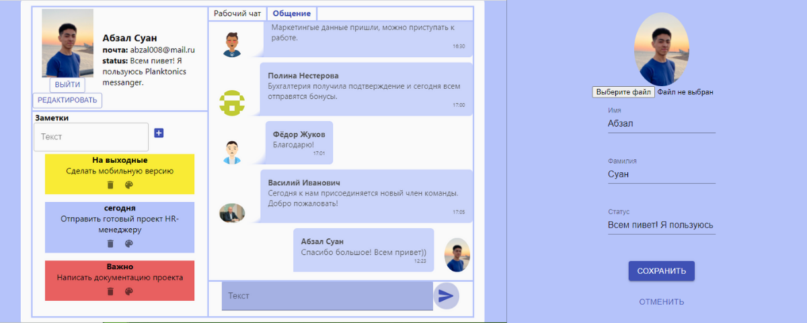
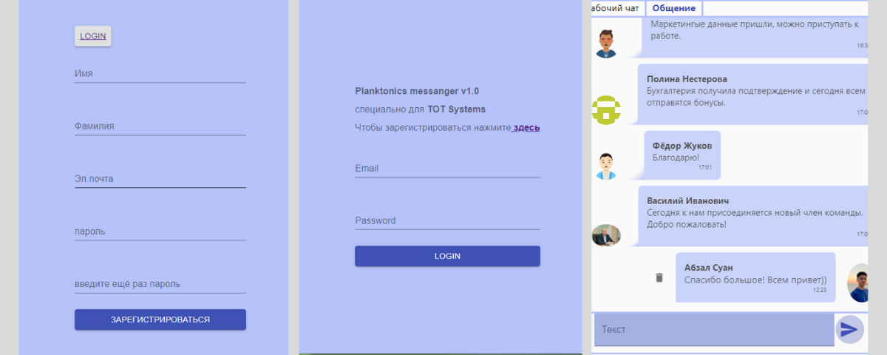

# Planktonics messanger - React & Redux

### Planktonics messanger screens: Профиль, заметки, чат.



### Planktonics messanger screens: Логинизация, регистрация, режим редактирования.



## Ипользованные технологии:

1. [Create React Redux App](https://github.com/reduxjs/cra-template-redux) -- для создания проекта и управления состоянием приложения.
2. [React-router-dom](https://reactrouter.com) -- для переключения между страницами.
3. [Material-ui](https://github.com/mui-org/material-ui) -- для компонент и икон.
4. [Formik](https://formik.org) - для создания полей форм с валидацией.
5. [React-colorful](https://github.com/omgovich/react-colorful) - для цветовой политры.
6. [Tippy](https://atomiks.github.io/tippyjs) - для анимации компонентов.
7. [React-helmet](https://github.com/nfl/react-helmet) - для изменения названия проекта, универсальный "шлем" для React.

## Описание проекта:

- Использован ассоциативный массив, алгоритм сортировки О(1).
- Компонентный подход для полей ввода, сообщениий и т.д.
- Кастомные стили для заметок, есть режимы редактирования. Можно создавать, редактировать, удалять.
- В чате для общения можно отправлять, удалять или редактировать сообщения.
- Данные в чатах берутся из статического файла.
- Данные пользователя при регистрации, логинизации, в заметках и сообщениях хранятся в Local storage.

**[Демо версия проекта](https://hj-abzal.github.io/TOT-Systems-network)**

## Скачивание

```
yarn
```

## Старт приложения

```
yarn start
```

## Build

```
yarn build
```

#### Контакты:

[](https://github.com/https://github.com/hj-abzal) [](https://www.linkedin.com/in/https://www.linkedin.com/in/abzal-suan//) [](https://www.instagram.com/https://www.instagram.com/hj_abzal//) [](https://hyojeong-abzal.github.io/my-portfolio/)
